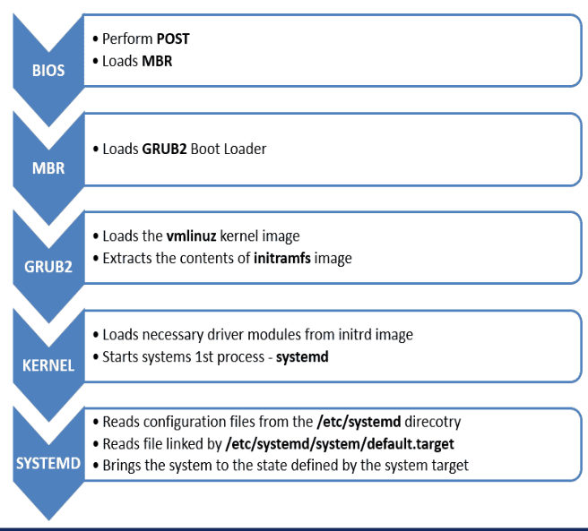

# Inspeccion de dispositivos en linux

- Un servidor no es una compu.
- Para un servidor es segun los requerimientos del cliente (almacenamiento)

http://mundo.openit.com.bo/?p=1213

Para modificar la red:

https://github.com/joseafon/netplan-easy

https://github.com/ilikenwf/apt-fast

```
cat /etc/netplan/00-installer-config.yaml
```

## Cargador de arranque

GRUB

## Proceso



```
dmesg | grep -i error
dmesg -T // para saber en q momento a pasado
```

Para systemd:

```
journalctl --list-boots
```
