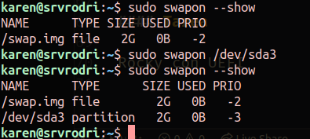

## Disenho del disco duro

Dispositivos de almacenamientos

### Puntos de montaje

`/` todo empieza en la raiz

examples:

/maria /carlos /juan si queremos esas particiones quedara algo ccomo:
/home/maria /home/carlos /home/juan

`/mnt`means `montaje` para poner archivos que no son parte del sistema
como `/mnt/cdrom` `/mnt/floopy`

**Mantener las cosas separadas**
Como para archivos personales de usuarios en `/home`, servidor web o base de datos en `/var`

### Particion de arranque (/boot)

GEstor de arranque GRUB2/GRUB Legacy(mas antiguo)

### Particion de intercambio

La swap ayuda pero en otros perjudica

- Un servido jamas hiberna

### Laboratorio UEFI

- Verificar la particion `/boot/efi`

```
df -Th
```

- Verificar carpeta /sys/firmware/efi

```
ls /sys/firmware/efi
```

- `sudo efibootmgr`

```
VBoxManage showmediuminfo VirtualBox\ VMs/ubuntu-srv-20-uefi/ubuntu-srv-20-uefi.vdi
```

Defragmentar un disco: para que los datos esten continuos

- No se recomienda Defragmentar una ssd

DE derecha a izquierda, de otro modo se tendra que copiar lo ocupado

Validar la swap

```
free -h
sudo swapon --show
sudo fdisk -l
// para empezar a usar
sudo swapon /dev/sda3
// confimamos que se vea
sudo swapon --show
free -h // en este ejemplo se mostraran 4G
```



Para montar en el inicio de sesion

```
cat /etc/fstab
sudo fdisk -l /dev/sda
```

Herramienta para sacar el uuid

```
// copiamos el uuid
blkid /dev/sda3
//
sudo nano /etc/fstab
```

Tomamos el uuid:

Lo pegamos como swap:


Cargamos todas la particiones swap:


```
// para volver a cargar todas las particiones swap
sudo swapon -a
```

Con esto ya lo podemos reiniciar y ya estara montado desde la carga.

#### LVM

#### Tarea

Rocky con UEFI
