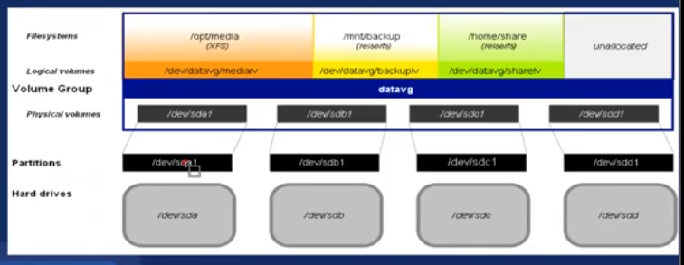

Los RAIDs fisicos son mejores que los hechos por el SO o sistema de particiones

# 3.4 LVM

Logical volume managmnt (GEstion de volumenes logicos)

Caracteristicas:

- Redimencionado de grupos logicos
- Redimencionado de volumenes logicos

Niveles: Son 3

- Volumenes fisicos (PV): capa fisica. Es el disco duro fisico
- Grupos de volumen (VG): capa fisica. Agrupaciones de todos los discos duros
- Volumenes logicos (LV): abstraccion. Donde el SO se va montar



## Lab

Instalacion de Ubuntu con LVM manual

- Todo normal hasta que llegamos a configurar el almacenamiento Custom
- Primero creamos el archivo `/boot` 'Add GPT partition' Size: `500M` formato: `ext4` mount: `/boot`
- 'Add GPT partition' size: (vacio) formato: `Leave unformatted`
- Se habilita 'Crear Grupo de volumenes (LVM)' `enter` nombre: (default) dispositivo: check `partition 3`
- sobre el volumen group 'vg0' `enter` 'Create logical volume' nombre: (default) size: 2G formato: swap
- sobre el volumen group 'vg0' `enter` 'Create logical volume' nombre: (default) size: 10G formato: ext4 mount: `/`
- `Hecho`

Cada volunen logico se creara un dispositivo en `/dev/mapper` compuesto por el nombre del grupo de volumen guion nonmbre de volumen logico ej, `/dev/mapper/servidores-ftp` tambien se creara un link simbolico de forma `/dev/frupod-volumen/volumen-logico` ej. `/dev/servidores/ftp`

```
lvcreate --size <N> --name <name> <nombre de vol. group >
lvcreate --size 10G --name ftp servidores
```

Nos muestran los volumenes logicos creados `sudo fdisk -l`

### Agregamos un nuevo volumen logico de 4G

- Agregamos 1 disco duro de 4G
- PAra ver los volumenes fisicos `pvdisplay` por ahora solo existe uno
- Para ve los volumenes grupo `vgdisplay`
- Para ve los volumenes logicos `lvdisplay`
- `mkdir /mnt/data00`
- `sudo lvcreate -L 4G -n lv-2 vg0`
- `lvdisplay` listamos y vemos el ultimo q creamos
- ahora formateamos `sudo mkfs.ext4 /dev/vg0/lv-2` o `sudo mkfs.ext4 /dev/mapper/vg0-lv--2` msg de done
- ahora montamos `sudo mount /dev/mapper/vg0-lv--2 /mnt/data00`
- vemos `mount` lo ultimo dice '/dev/mapper/vg0-lv--2 on /mnt/data00 type ext4'
- vemos `cat /etc/fstab` y vemos q los volumenes esta cifrados
- para encontra el nuestro lo buscamos en `ls -al /dev/disk/by-id/dm-uuid-LVM*` el dm-2 es el q necesitamos
- Editamos 'sudo nano /etc/sftab' agregamos una nueva linea con el uuid que copiamos
- `mount`
- `sudo umount /mnt/data00` desmontamos
- `sudo mount /mnt/data00`
- `mount`

### Agregamos un nuevo disco y extendemos el vol. group

- Agregamos un disco de 3G
- `sudo vgdisplay` y vemos que tenemos free: 3.5G maso
- `sudo fdisk -l` lo buscamos `/dev/sdb`
- `sudo vgextend vg0 /dev/sdb` extendemos el volumen group `vgextend <name vol group> <particiones>`
- `sudo vgdisplay` vemos que aumento a 6.5G
- `sudo pvdisplay` ahora tenemos 2
